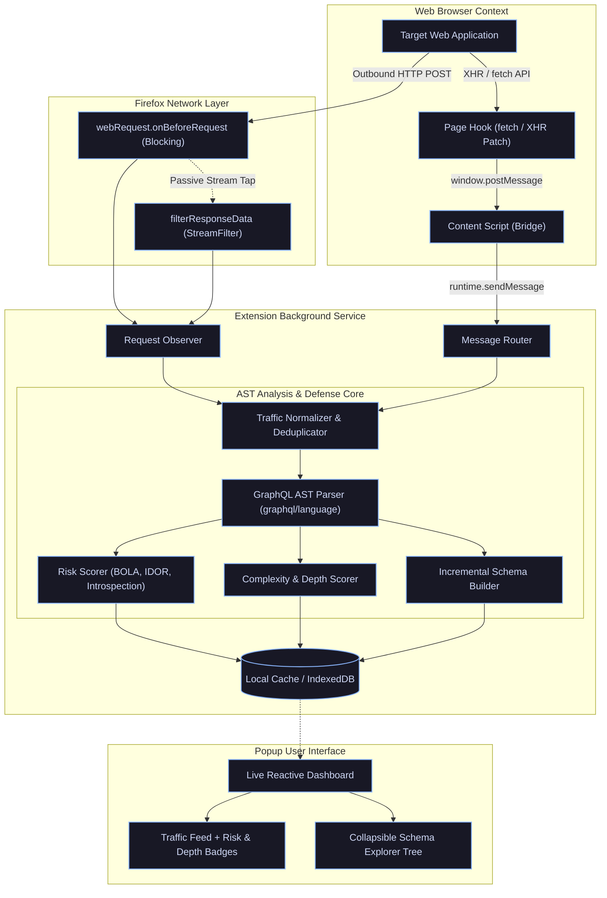

# ⚡ GraphQL Hunter

<div align="center">

```ascii
   ██████╗ ██████╗  █████╗ ██████╗ ██╗  ██╗ ██████╗ ██╗         ██╗  ██╗██╗   ██╗███╗   ██╗████████╗███████╗██████╗ 
  ██╔════╝ ██╔══██╗██╔══██╗██╔══██╗██║  ██║██╔═══██╗██║         ██║  ██║██║   ██║████╗  ██║╚══██╔══╝██╔════╝██╔══██╗
  ██║  ███╗██████╔╝███████║██████╔╝███████║██║   ██║██║         ███████║██║   ██║██╔██╗ ██║   ██║   █████╗  ██████╔╝
  ██║   ██║██╔══██╗██╔══██║██╔═══╝ ██╔══██║██║▄▄ ██║██║         ██╔══██║██║   ██║██║╚██╗██║   ██║   ██╔══╝  ██╔══██╗
  ╚██████╔╝██║  ██║██║  ██║██║     ██║  ██║╚██████╔╝███████╗    ██║  ██║╚██████╔╝██║ ╚████║   ██║   ███████╗██║  ██║
   ╚═════╝ ╚═╝  ╚═╝╚═╝  ╚═╝╚═╝     ╚═╝  ╚═╝ ╚══▀▀═╝ ╚══════╝    ╚═╝  ╚═╝ ╚═════╝ ╚═╝  ╚═══╝   ╚═╝   ╚══════╝╚═╝  ╚═╝
```

**Offensive-Security Firefox Extension for Real-Time GraphQL Traffic Interception, Attack-Surface Discovery, Zero-Introspection Schema Reconstruction & Automated BOLA Auditing.**

[](#installation--quickstart)
[](#tech-stack)
[](#deep-dive-ast-query-analyzer)
[](#license)
[](#development-roadmap)

<br/>

[Key Features](#key-features) •
[Architecture](#architecture) •
[Vulnerability Detection](#heuristic-security-risk-engine) •
[Schema Reconstruction](#zero-introspection-schema-reconstruction) •
[Quickstart](#installation--quickstart) •
[Roadmap](#development-roadmap)

---

</div>

## 🎯 What is GraphQL Hunter?

**GraphQL Hunter** is a lightweight, high-performance Firefox extension tailored for penetration testers, bug bounty hunters, and application security engineers.

As modern Single Page Applications (SPAs) shift towards GraphQL backends, security auditing often hits a brick wall:
* **85%+ of production GraphQL endpoints have introspection (`__schema`) disabled**, crippling traditional vulnerability scanners.
* **Complex query batching** multiplexes multiple operations into single HTTP POST payloads, bypassing basic WAFs and request loggers.
* **Deeply nested query attacks** cause exponential server-side CPU & memory consumption (DoS amplification) while appearing as normal HTTP `200 OK` requests.
* **Broken Object-Level Authorization (BOLA / IDOR)** runs rampant in mutation parameters and field-level ID lookups, frequently missed during manual browsing.

**GraphQL Hunter solves this silently in real time.** While you interact with the target web application, the extension intercepts in-flight GraphQL queries, parses them into full Abstract Syntax Trees (AST), reconstructs the backend schema on the fly, scores query complexity, and highlights authorization vulnerabilities directly in a slick dark-mode HUD.

---

## ⚡ Key Features

| Feature | Description |
| :--- | :--- |
| **🛰️ Dual-Engine Passive Interception** | Seamlessly captures traffic using both native Firefox **`filterResponseData` StreamFilter** (network layer) and an **in-page Fetch/XHR monkey-patch hook** (DOM layer). |
| **🧠 AST-Powered Query Analysis** | Operates on the official `graphql` AST (`parse` & `visit`) rather than fragile regular expressions. Accurately unpacks operations, field selections, argument signatures, and variables. |
| **🛡️ Heuristic Security Risk Engine** | Automatically scores and flags **BOLA in Mutations**, **Introspection reconnaissance**, **IDOR lookup fields**, **Query Nesting DoS**, and **Over-fetching data leaks**. |
| **🧬 Zero-Introspection Schema Builder** | Incrementally reverse-engineers the target's GraphQL schema purely from observed ASTs. Discovers types, fields, argument lists, and endpoints without sending active introspection probes. |
| **📐 Query Complexity & DoS Calculator** | Analyzes selection nesting depth and list-field multipliers (`list*`, `all*`, `*Edges`, `*Nodes`, `*Connection`) to estimate backend computational cost and highlight resource exhaustion risks. |
| **📦 Transparent Batch Request Unpacking** | Decodes array-batched GraphQL requests (`[{query: ...}, {query: ...}]`), evaluating each operation individually and attributing risks independently. |
| **🎛️ Cyberpunk HUD Popup UI** | Built with a high-contrast dark aesthetic, real-time reactive feed updates, interactive collapsible schema trees, status pills, and latency telemetry. |

---

## 🏛️ Architecture & Interception Flow

GraphQL Hunter employs a multi-tiered pipeline designed for zero latency overhead and non-blocking operation:



---

## 🛡️ Heuristic Security Risk Engine

Every intercepted query is inspected by the heuristic risk engine (`risk-scorer.ts`), outputting prioritized findings with context-aware remediation guidance:

| Risk Level | Vulnerability / Detection | Heuristic Criteria | Security Impact |
| :---: | :--- | :--- | :--- |
| **`CRITICAL`** | **Potential BOLA in Mutation** | Mutation operation utilizing object ID variables (`id`, `uuid`, `pk`, `userId`, `*Id`). | Attackers can mutate records belonging to other tenants or users by swapping identifier parameters. |
| **`HIGH`** | **Introspection Query Observed** | Field accesses matching `__schema`, `__type`, `__typename`, `__InputValue`, etc. | Exposes complete API attack surface, hidden types, internal documentation, and administrative endpoints. |
| **`HIGH`** | **Deep Query Nesting (DoS)** | Operation AST selection set nesting depth **`depth > 5`**. | Triggers recursive database queries or exponential resolver loops, causing server thread starvation. |
| **`MEDIUM`** | **Object Lookup by ID** | Query operations querying records using ID arguments or variables. | Horizontal privilege escalation vector; target must enforce strict tenant-boundary authorization. |
| **`MEDIUM`** | **High Query Complexity Cost** | Heuristic computational cost **`cost > 100`** (nested depth × list multipliers). | Circumvents naive HTTP rate-limiters; server lacks query cost analysis guards. |
| **`MEDIUM`** | **Field-Level ID Arguments** | Child fields containing identifier parameters (`nodeId`, `guid`, `key`). | Fine-grained IDOR vulnerability on child relationships. |
| **`LOW`** | **Excessive Field Count / Over-fetching** | Operations selecting **`> 20 fields`** in a single execution. | High potential for sensitive data exposure and database projection overhead. |
| **`INFO`** | **Anonymous Operation** | Query missing operation name (`query { ... }`). | Evades audit log tracking and bypasses operation-name-based gateway rate limits. |

---

## 🧬 Zero-Introspection Schema Reconstruction

When introspection queries are blocked by WAFs or server settings, GraphQL Hunter builds an AST-based replica of the backend schema from ordinary web traffic (`schema-builder.ts`).

### Reconstructed Schema Model
```json
{
  "types": {
    "UserProfile": {
      "typeName": "UserProfile",
      "fields": {
        "email": { "args": [], "seenInOps": ["query"], "observationCount": 14 },
        "updatePassword": { "args": ["newPass", "token"], "seenInOps": ["mutation"], "observationCount": 2 },
        "accountRole": { "args": [], "seenInOps": ["query"], "observationCount": 14 }
      }
    }
  },
  "endpoints": ["https://api.target.com/graphql"],
  "lastUpdated": 1726217400000
}
```

* **Zero Intrusion**: No active requests sent; 100% passive listening.
* **Argument Signature Mapping**: Collects and normalizes argument keys across different query variations.
* **Operation Tracking**: Marks whether a field was observed in a `query`, `mutation`, or `subscription`.
* **Dynamic Tree Explorer**: Rendered directly in the extension popup with interactive collapse/expand controls.

---

## 📐 Query Complexity & DoS Cost Engine

GraphQL Hunter calculates the server-side impact of queries before exploitation:

$$\text{Estimated Cost} = \sum (\text{Field Depth} \times \text{List Multiplier})$$

* **Depth Calculation**: Recursively evaluates nested `SelectionSetNode` elements.
* **List Multiplier ($\times 3$)**: Automatically applied to fields matching list patterns:
  `/(list|all|search|find|filter|get[A-Z].*s$|.*List$|.*Nodes$|.*Edges$|.*Items$|.*Results$|.*Connection$)/`
* **Fragment Spreads**: Safely handles inline fragments and assigns weighted baseline costs to named fragments.
* **Alert Thresholds**: Automatically triggers when `depth > 5` or `cost > 100`.

---

## 🖥️ Extension HUD (Popup Interface)

The extension popup features a sleek, dark terminal aesthetic built for rapid situational awareness:

```text
┌─────────────────────────────────────────────────────────────┐
│ ⬡ GraphQL Hunter  v0.1                     ● Hunting       │
├─────────────────────────────────────────────────────────────┤
│   142       4          18          12           7           │
│ CAPTURED ENDPOINTS  MUTATIONS   BATCHED      RISKS          │
├─────────────────────────────────────────────────────────────┤
│  [ ≡ Traffic ]          [ ⊞ Schema  (24) ]                  │
├─────────────────────────────────────────────────────────────┤
│  MUT  updateUserAccount                d3  [ CRITICAL ] 200 │
│       3 fields · /api/v2/graphql                      84ms  │
│                                                             │
│  QRY  getUserInvoices                  d6  [ HIGH ]     200 │
│       14 fields · /api/v2/graphql                    142ms  │
│                                                             │
│  B2   Batch (2 Operations)                 [ MEDIUM ]   200 │
│       8 fields · /graphql                             61ms  │
│                                                             │
│  QRY  getPublicFeed                    d2  [ LOW ]      200 │
│       24 fields · /graphql                            39ms  │
└─────────────────────────────────────────────────────────────┘
```

---

## 🚀 Installation & Quickstart

### Prerequisites
* [Node.js](https://nodejs.org/) (version 18.x or later recommended)
* [npm](https://www.npmjs.com/) (version 9.x or later)
* [Mozilla Firefox](https://www.mozilla.org/firefox/) (version 109.0 or later)

### 1. Clone the Repository
```bash
git clone https://github.com/nm0x-and-sharpshooter/GraphQL-Hunter.git
cd GraphQL-Hunter
```

### 2. Install Dependencies
```bash
npm install
```

### 3. Build the Extension
```bash
# Build production bundle
npm run build

# Or run in development watch mode
npm run dev
```
The compiled, ready-to-load extension will be generated in the `dist/` directory.

### 4. Load into Firefox
1. Open Firefox and navigate to `about:debugging#/runtime/this-firefox`.
2. Click **"Load Temporary Add-on…"**.
3. Navigate to the project's `dist/` folder and select `manifest.json`.
4. The **GraphQL Hunter** hex-shield icon will now appear in your browser toolbar!

---

## 🛠️ Project Structure

```text
GraphQL-Hunter/
├── extension/
│   ├── manifest.json              # WebExtension Manifest (v2 with Firefox Gecko config)
│   ├── types/
│   │   ├── graphql.ts             # Domain models (CapturedRequest, SchemaModel, RiskLevel)
│   │   └── messages.ts            # Message definitions (Popup <-> Background <-> Content)
│   ├── background/
│   │   ├── background.ts          # Core service worker entry point
│   │   ├── request-observer.ts    # webRequest + filterResponseData StreamFilter engine
│   │   ├── message-router.ts      # Pub/sub broker for extension messages
│   │   └── storage.ts             # Session persistence & schema store
│   ├── content/
│   │   ├── content.ts             # Isolated content script bridging DOM <-> Background
│   │   └── page-hook.ts           # Page-world monkey-patch for fetch() & XMLHttpRequest
│   ├── analysis/
│   │   ├── query-analyzer.ts      # AST query parser & AST traversal engine
│   │   ├── risk-scorer.ts         # Heuristic security risk scoring engine
│   │   ├── complexity-scorer.ts   # Maximum depth & cost estimation (DoS defense)
│   │   └── schema-builder.ts      # Zero-introspection partial schema reconstructor
│   └── popup/
│       ├── popup.html             # HUD shell (Traffic feed, Schema panel, stats bar)
│       ├── popup.css              # Cyberpunk dark theme styles
│       └── popup.ts               # UI controller, live event listeners & tree renderer
├── package.json                   # Dependencies, scripts & build configuration
├── tsconfig.json                  # Strict TypeScript compiler options
├── webpack.config.js              # Multi-target Webpack bundler & asset copy pipeline
└── README.md                      # Project documentation
```

---

## 🗺️ Development Roadmap

GraphQL Hunter is being built through rapid, focused engineering sprints:

- [x] **Day 1: Interception Core**
  - Firefox `webRequest` API listener with `requestBody` decoding
  - `filterResponseData()` response body streaming interception
  - Page-world fetch/XHR hook for client-side queries
  - Live HUD popup with real-time stats and feed
- [x] **Day 2: AST Analysis & Risk Engine**
  - AST parsing via `graphql` library
  - Field and variable extractor
  - Heuristic risk scorer (BOLA in mutations, Introspection detection, Over-fetching)
  - Color-coded risk badges with diagnostic tooltips
- [x] **Day 3: Schema Reconstruction & Complexity Scorer**
  - Zero-introspection partial schema reconstruction from live ASTs
  - Recursive AST query depth and complexity cost calculator
  - Dual-view tab system in popup (Traffic vs. Schema)
  - Interactive collapsible schema tree explorer with argument and frequency breakdown
- [ ] **Day 4: Active BOLA & IDOR Validation**
  - Automated ID parameter permutation and auth token tampering
  - Multi-identity replay comparison
- [ ] **Day 5: Query Batching & Rate-Limit Bypass Fuzzing**
  - Automated batching attack generation
  - Aliased query amplification testing
- [ ] **Day 6: CSRF & CORS Validator**
  - Content-Type enforcement auditing (`application/json` vs `application/x-www-form-urlencoded`)
  - Origin reflection checks
- [ ] **Day 7: Directive Injection & Injection Scanner**
  - `@skip` / `@include` logic flaw testing
  - SQLi / NoSQLi payload fuzzing via GraphQL variables
- [ ] **Day 8: Export & Reporting**
  - SDL (Schema Definition Language) export
  - Burp Suite / Postman collection export
  - Markdown vulnerability report generator
- [ ] **Day 9–10: Dedicated DevTools & Full-Page Dashboard**
  - Full-screen offensive security workbench
  - Interactive GraphQL playground with mutation replayer

---

## ⚙️ Available Scripts

| Command | Action |
| :--- | :--- |
| `npm run build` | Compiles and bundles production-ready extension artifacts into `dist/`. |
| `npm run dev` | Runs Webpack in watch mode with development source maps for rapid iteration. |
| `npm run build:dev` | Runs a single development build without file watchers. |
| `npm run clean` | Purges the `dist/` directory. |

---

## 🔒 Security & Responsible Disclosure

> [!WARNING]
> **GraphQL Hunter** is designed solely for authorized penetration testing, security research, and educational purposes. Intercepting or attacking web applications without prior written authorization is strictly illegal. Always adhere to responsible disclosure guidelines and scope boundaries.

---

## 📄 License

This project is licensed under the **Apache License 2.0**. See the [LICENSE](LICENSE) file for complete details.

<div align="center">

Made with 💜 for the Application Security & Penetration Testing Community.

</div>
